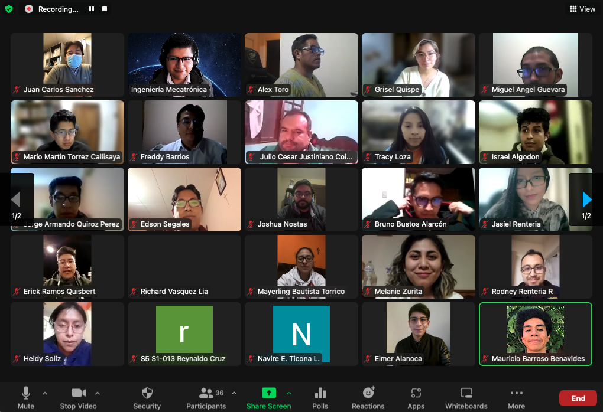

<h1 align="center">  Bootcamp on Computer Vision for the Sustainable Development Goals </h1>

  <a href="#Description"><b>Description</b></a> |
  <a href="#Logistics"><b>Logistics</b></a> |
  <a href="#Content"><b>Content</b></a> |
  <a href="#Cohort"><b>Cohort</b></a> |
  <a href="#Sponsors"><b>Sponsors</b></a> 

## Description

Computer vision is a scientific discipline that has recently made good progress in various sub-areas (e.g. object segmentation, video classification, disease detection), achieving a level of performance that was unexpected just a few years ago. With the advent of new AI techniques, computer vision has opened up possibilities in many real-world domains, including transportation (autonomous cars, drones), and smart cities (disaster monitoring, surveillance systems). Although these applications provide massive meaning and value to this technology, their implementation and teaching in Bolivia are still limited. In contrast, the expansion of the Internet and mobile devices (computer devices connected to the network) in Bolivia offers a unique opportunity for technology communities, made up of software developers, engineers, or students, to become more involved in this field.

The Sustainable Development Goals (SDGs) are a set of goals posed by the United Nations to achieve sustainable development by 2030 without harnessing living beings and nature. Expanding the scope of computer vision applications to address the SDG goals could lead to the generation of more ideas and solutions that take advantage of this technology, and in this way positively impact the lives of the Bolivian society. For this reason, the Bolivian Catholic University "San Pablo", with the sponsorship of Google AI, launched the program "Bootcamp: Computer Vision for the Sustainable Development Goals", held between March 24 and June 29, 2022. The present repository contains the materials developed during the Bootcamp. 

## Lecturer
| Edwin Salcedo           | 
|:-------------------------:|
||

## Teaching Assistants

Christian Conchari            |  Ana Martinez
:-------------------------:|:-------------------------:
  |  

## Logistics
- **Duration:** 3 months
- **Location:** Remote over Zoom. We primarly met in the beggining and in the end, for the final projects presentation. 
- **Schedule:** Wednesdays and Thursdays, from 19:00 to 21:15 → Theory and practice
- **Office Hours:** Tuesdays, from 19:00 to 20:30 → Resolution of Excercises and Doubts (Optional)
- **Website:** [http://www.hackcities.com](http://www.hackcities.com)
- **Brochure:** 
- **Main Teaching Language:** Spanish
- **Lecture Recordings (Participants Only):** [Google Drive](https://drive.google.com/drive/folders/1IKDDlpe-mI9HijsmmHgwNL0BJjzk29Uk?usp=sharing)
- **Office Hours Recordings (Participants Only):** [Google Drive](https://drive.google.com/drive/folders/1nVSL60GrZDUsNwPmY8PcU5Xfnki9Iod0?usp=sharing)
- **LMS (Participants Only):** [Google Classroom](https://classroom.google.com/u/0/c/NDcyMDcxMzg3MTI2)
- **Final Project Rubrics (Participants Only):** 

## Content

| Lesson | Topic | Slides | Laboratory | Supplementary Material |
| :-: |  ----- |  :-: |  ----- |  ----- | 
| 01 | Introduction to Computer Vision |  |  |
| 02 | History of Computer Vision |  | |
| 03 | Fundamentals of Image Formation and Processing |  | [Laboratory 1: Introduction to Colab, OpenCV and Numpy](https://github.com/EdwinTSalcedo/Bootcamp-Computer-Vision-for-the-SDGs/blob/087b9e0474e5497a03c6c8073e79721d24da3ce1/notebooks/Laboratorio%201_%20Introducci%C3%B3n%20a%20Colab,%20OpenCV%20y%20Numpy.ipynb) | 
| 04 | Point Processing |  | [Laboratory 2: Point Processing](https://github.com/EdwinTSalcedo/Bootcamp-Computer-Vision-for-the-SDGs/blob/f2dd3b0eb4edb18d308a472bb5904c74b8eefe09/notebooks/Laboratorio%202_%20Procesamiento%20de%20Puntos.ipynb) | ▪ [Digital Image Processing - Book by Rafael C. Gonzales and Richard Woods ](https://www.codecool.ir/extra/2020816204611411Digital.Image.Processing.4th.Edition.www.EBooksWorld.ir.pdf) |
| 05 | Image Filtering |  | [Laboratory 3: Edge Detection](https://github.com/EdwinTSalcedo/Bootcamp-Computer-Vision-for-the-SDGs/blob/f2dd3b0eb4edb18d308a472bb5904c74b8eefe09/notebooks/Laboratorio%203_%20Detecci%C3%B3n%20de%20Bordes.ipynb)   [Laboratory 4: Canny Edge Detector](https://github.com/EdwinTSalcedo/Bootcamp-Computer-Vision-for-the-SDGs/blob/f2dd3b0eb4edb18d308a472bb5904c74b8eefe09/notebooks/Laboratorio%204_%20Detector%20de%20Bordes%20Canny.ipynb) | 
| 06 | Image Transforms |  |  [Laboratory 5: Image Transforms](https://github.com/EdwinTSalcedo/Bootcamp-Computer-Vision-for-the-SDGs/blob/f2dd3b0eb4edb18d308a472bb5904c74b8eefe09/notebooks/Laboratorio%205_%20Transformadas%20de%20la%20Imagen.ipynb) | 
| 07 | Morphological Algorithms |  |  [Laboratory 6: Morphological Algorithms](https://github.com/EdwinTSalcedo/Bootcamp-Computer-Vision-for-the-SDGs/blob/f2dd3b0eb4edb18d308a472bb5904c74b8eefe09/notebooks/Laboratorio%206_%20Operadores%20y%20Algoritmos%20Morfol%C3%B3gicos.ipynb) | 
| 08 | Image Segmentation |  |  [Laboratory 7: Image Segmentation](https://github.com/EdwinTSalcedo/Bootcamp-Computer-Vision-for-the-SDGs/blob/f2dd3b0eb4edb18d308a472bb5904c74b8eefe09/notebooks/Laboratorio%207_%20Segmentaci%C3%B3n%20de%20Im%C3%A1genes.ipynb) | 
| 09 | Introduction to Motion |  || [Video Processing Examples](https://github.com/EdwinTSalcedo/video-processing) | 
| SDGs | 17 Sustainable Development Goals |   |  |  |
| 10 | Data Processing for Computer Vision |  | [Laboratory 8: Introduction to Pandas](https://github.com/EdwinTSalcedo/Bootcamp-Computer-Vision-for-the-SDGs/blob/f2dd3b0eb4edb18d308a472bb5904c74b8eefe09/notebooks/Laboratorio%208_%20Introducci%C3%B3n%20a%20Pandas.ipynb) | ▪ [Pandas from Zero - Course by Juan Barrios](https://www.juanbarrios.com/curso-de-pandas-completo-desde-cero/)  |
| 11 | Introduction to Machine Learning |  | [Laboratory 9: Introduction to TensorFlow](https://github.com/EdwinTSalcedo/Bootcamp-Computer-Vision-for-the-SDGs/blob/f2dd3b0eb4edb18d308a472bb5904c74b8eefe09/notebooks/Laboratorio%209_%20Introducci%C3%B3n%20a%20TensorFlow.ipynb)  | ▪ [TensorFlow Tutorials](https://www.tensorflow.org/tutorials) |
| 12 | Neural Networks for Computer Vision |  | [Laboratory 10: Neural Networks for Computer Vision](https://github.com/EdwinTSalcedo/Bootcamp-Computer-Vision-for-the-SDGs/blob/f2dd3b0eb4edb18d308a472bb5904c74b8eefe09/notebooks/Laboratorio%2010_%20Redes%20Neuronales%20para%20Visi%C3%B3n%20Artificial.ipynb) | ▪ [TensorFlow Tutorial: Basic Classification with Keras](https://www.tensorflow.org/tutorials/keras/classification) |
| 13 | Training Optimisation |  |  |  ▪ [TensorFlow Tutorial: Overfit and Underfit](https://www.tensorflow.org/tutorials/keras/overfit_and_underfit)  |
| 14 | Convolutional Neural Network |  | [Laboratory 11: Convolutional Neural Networks](https://github.com/EdwinTSalcedo/Bootcamp-Computer-Vision-for-the-SDGs/blob/f2dd3b0eb4edb18d308a472bb5904c74b8eefe09/notebooks/Laboratorio%2011_%20Redes%20Neuronales%20Convolucionales.ipynb) | ▪ [TensorFlow Tutorial: CNNs](https://www.tensorflow.org/tutorials/images/cnn)  |
| 15 | Transfer Learning |  |  | ▪ [TensorFlow Tutorial: Transfer Learning and Fine Tunning](https://www.tensorflow.org/tutorials/images/transfer_learning) |
| 16 | Object Detection |  | [Laboratory 12: Object Detection with TF Hub](https://github.com/EdwinTSalcedo/Bootcamp-Computer-Vision-for-the-SDGs/blob/f2dd3b0eb4edb18d308a472bb5904c74b8eefe09/notebooks/Laboratorio%2012_%20Detecci%C3%B3n%20de%20Objetos.ipynb) | ▪ [TensorFlow Tutorial: Object Detection](https://www.tensorflow.org/hub/tutorials/object_detection) | 
| 17 | Semantic Segmentation |  |  | ▪ [TensorFlow Tutorial: Image Segmentation](https://www.coursera.org/projects/deploy-models-tensorflow-serving-flask) | 
| 18 | Instance Segmentation |  |  | 
| 19 | Model Deployment |  | [Laboratory 13: Model Deployment with TensorFlow Lite](https://github.com/EdwinTSalcedo/Bootcamp-Computer-Vision-for-the-SDGs/blob/2a06f9400fc6e555cfefe4f6000837cf0211951c/notebooks/Laboratorio%2013_%20Despliegue%20de%20modelos%20con%20Tensorflow%20Lite.ipynb) | ▪ [Deploy Models with TensorFlow Serving and Flask on Coursera](https://www.coursera.org/projects/deploy-models-tensorflow-serving-flask)   ▪ [Deploy Models Using TensorFlow Serving - Example](https://colab.research.google.com/github/EricEsajian/neural_network_models/blob/master/Deploy_Models_Using_TensorFlow_Serving.ipynb) |

## Cohort

- **Accepted:** 60 participants

- **Finalists:** 40 participants from 6 cities in Bolivia

## Best Proposed Solution for the SDGs 🏆
- Team: Linfocitos 

- Team members: [Sharon Calcina](https://github.com/SHARON-CALCINA), [Patricia Cervantes](https://github.com/Micpcm), [Erick Ramos](https://github.com/erickramosQ), [Richard Vasquez](https://www.linkedin.com/in/richard-vasquez-lia-b2787911b). 

- Video: https://youtu.be/nGt4fcp0AHc 

## Sponsors

Google AI | UCB | IMT | British Embassy
:-------------------------:|:-------------------------: | :-------------------------: | :-------------------------:
  |   |  | 

## Aknowledgements

We thank Natalia Guerreros, founder of Desafio ODS, for the two-sessions on the progress and challenges to accomplish Sustainable Development Goals in Bolivia 🇧🇴.

## Copyright

The MIT License

Copyright ©  2022 HackCities: Urban Innovation

Permission is hereby granted, free of charge, to any person obtaining a copy of this software and associated documentation files (the "Software"), to deal in the Software without restriction, prior a proper referencing, including without limitation the rights to use, copy, modify, merge, publish, distribute, sublicense, and/or sell copies of the Software, and to permit persons to whom the Software is furnished to do so, subject to the following conditions:

The above copyright notice and this permission notice shall be included in all copies or substantial portions of the Software.

THE SOFTWARE IS PROVIDED "AS IS", WITHOUT WARRANTY OF ANY KIND, EXPRESS OR IMPLIED, INCLUDING BUT NOT LIMITED TO THE WARRANTIES OF MERCHANTABILITY, FITNESS FOR A PARTICULAR PURPOSE AND NONINFRINGEMENT. IN NO EVENT SHALL THE AUTHORS OR COPYRIGHT HOLDERS BE LIABLE FOR ANY CLAIM, DAMAGES OR OTHER LIABILITY, WHETHER IN AN ACTION OF CONTRACT, TORT OR OTHERWISE, ARISING FROM, OUT OF OR IN CONNECTION WITH THE SOFTWARE OR THE USE OR OTHER DEALINGS IN THE SOFTWARE.