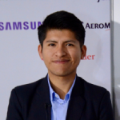
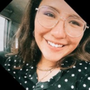

<h1 align="center">  Bootcamp on Computer Vision for the Sustainable Development Goals </h1>

  <a href="#Description"><b>Description</b></a> |
  <a href="#Logistics"><b>Logistics</b></a> |
  <a href="#Course Materials"><b>Content</b></a> |
  <a href="#Cohort"><b>Cohort</b></a> |
  <a href="#Sponsors"><b>Sponsors</b></a> 

## Description

Computer vision is a scientific discipline that has recently made good progress in various sub-areas (e.g. object segmentation, video classification, disease detection), achieving a level of performance that was unexpected just a few years ago. With the advent of new AI techniques, computer vision has opened up possibilities in many real-world domains, including transportation (autonomous cars, drones), and smart cities (disaster monitoring, surveillance systems). Although these applications provide massive meaning and value to this technology, their implementation and teaching in Bolivia are still limited. In contrast, the expansion of the Internet and mobile devices (computer devices connected to the network) in Bolivia offers a unique opportunity for technology communities, made up of software developers, engineers, or students, to become more involved in this field.

The Sustainable Development Goals (SDGs) are a set of goals posed by the United Nations to achieve sustainable development by 2030 without harnessing living beings and nature. Expanding the scope of computer vision applications to address the SDG goals could lead to the generation of more ideas and solutions that take advantage of this technology, and in this way positively impact the lives of the Bolivian society. For this reason, the Bolivian Catholic University "San Pablo", with the sponsorship of Google AI, launched the program "Bootcamp: Computer Vision for the Sustainable Development Goals", held between March 24 and June 29, 2022. The present repository contains the materials developed during the Bootcamp. 

## Lecturer
| Edwin Salcedo           | 
|:-------------------------:|
||

## Teaching Assistants

Christian Conchari            |  Ana Martinez
:-------------------------:|:-------------------------:
  |  

## Logistics
- **Duration:** 3 months
- **Location:** Remote over Zoom. We primarly met in the beggining and in the end, for the final projects presentation. 
- **Schedule:** Wednesdays and Thursdays, from 19:00 to 21:15 → Theory and practice
- **Office Hours:** Tuesdays, from 19:00 to 20:30 → Resolution of Excercises and Doubts (Optional)
- **Website:** [http://www.hackcities.com](http://www.hackcities.com)
- **Brochure:** 
- **Main Teaching Language:** Spanish
- **Recordings (Participants Only):** [Google Drive](https://drive.google.com/drive/folders/1yKkTLKZAvKAju2aWGT0lO681vwKRfieK?usp=sharing)
- **LMS (Participants Only):** [Google Classroom](https://classroom.google.com/u/0/c/NDcyMDcxMzg3MTI2)
- **Final Project Rubrics (Participants Only):** 

## Content

| Lesson | Topic | Slides | Laboratory | Supplementary Material |
| :-: |  ----- |  :-: |  ----- |  ----- |
| 01 | Introduction to Computer Vision |  | [Laboratory 1: Introduction to Colab, OpenCV and Numpy](https://github.com/EdwinTSalcedo/Bootcamp-Computer-Vision-for-the-SDGs/blob/087b9e0474e5497a03c6c8073e79721d24da3ce1/notebooks/Laboratorio%201_%20Introducci%C3%B3n%20a%20Colab,%20OpenCV%20y%20Numpy.ipynb) | - [CS231n Optimization](https://cs231n.github.io/optimization-1/)   - [Dive into DL: Chapter 11](https://d2l.ai/chapter_optimization/index.html)   - [Deep Learning: Chapter 8](https://www.deeplearningbook.org/contents/optimization.html)   - [Overview of Optimization](https://ruder.io/optimizing-gradient-descent/) |

## Best Projects

## Cohort

- Accepted

- Finalists

## Sponsors

## Aknowledgements

## Copyright

The MIT License

Copyright (c) 2020 HackCities: Urban Innovation

Permission is hereby granted, free of charge, to any person obtaining a copy of this software and associated documentation files (the "Software"), to deal in the Software without restriction, prior a proper referencing, including without limitation the rights to use, copy, modify, merge, publish, distribute, sublicense, and/or sell copies of the Software, and to permit persons to whom the Software is furnished to do so, subject to the following conditions:

The above copyright notice and this permission notice shall be included in all copies or substantial portions of the Software.

THE SOFTWARE IS PROVIDED "AS IS", WITHOUT WARRANTY OF ANY KIND, EXPRESS OR IMPLIED, INCLUDING BUT NOT LIMITED TO THE WARRANTIES OF MERCHANTABILITY, FITNESS FOR A PARTICULAR PURPOSE AND NONINFRINGEMENT. IN NO EVENT SHALL THE AUTHORS OR COPYRIGHT HOLDERS BE LIABLE FOR ANY CLAIM, DAMAGES OR OTHER LIABILITY, WHETHER IN AN ACTION OF CONTRACT, TORT OR OTHERWISE, ARISING FROM, OUT OF OR IN CONNECTION WITH THE SOFTWARE OR THE USE OR OTHER DEALINGS IN
THE SOFTWARE.